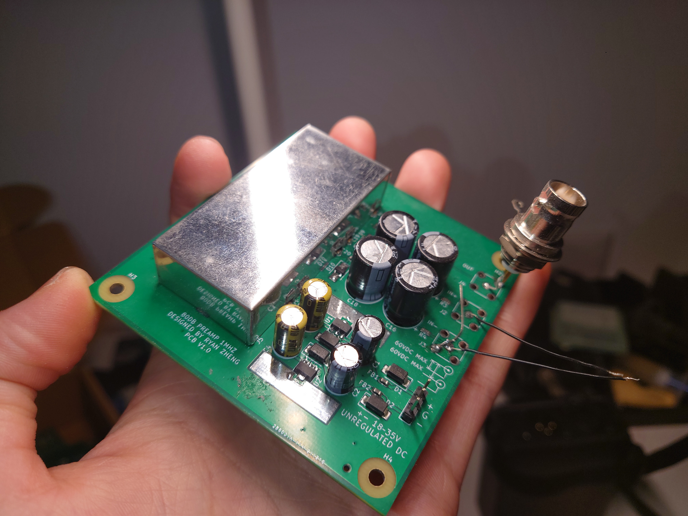

# noise-amp

A very high gain (80db or x10000) differential AC signal amplifier (LNA, pre-amplifier, noise amplifier, etc.) board based on EEVBlog community design.

[Original post](https://www.eevblog.com/forum/beginners/question-about-preamp-for-measuring-noise/msg98285/#msg98285)

Board is a 100x100mm 4-layer PCB which falls into the cheap sample tier at JLCPCB or PCBWay.

# Specs
- Gain: 80db nominal
- Bandwidth: <= 1MHz
- Power: +-18 to 35VDC, unregulated
- Connector: SMA for signal input and output, 2.54mm THT pads for power input.

Test was done with a 1M to 100R resistor divider in front of the input. Signal was a sigle-ended sine wave, so one of the input is shorted to ground. Channel 3 shows original signal before resistor divider. Channel 1 shows amplified output.

# Notes
- Use high quality electrolytic capacitors
- Keep away from transformers
- You can replace op-amps with other models that you have or like
- Avoid ground loop when using
- Ground one input if using sigle-ended
